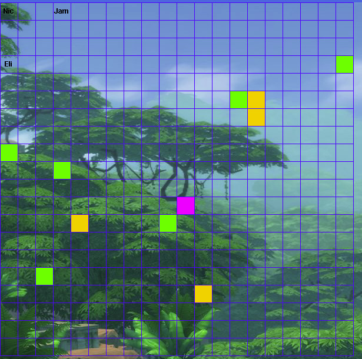
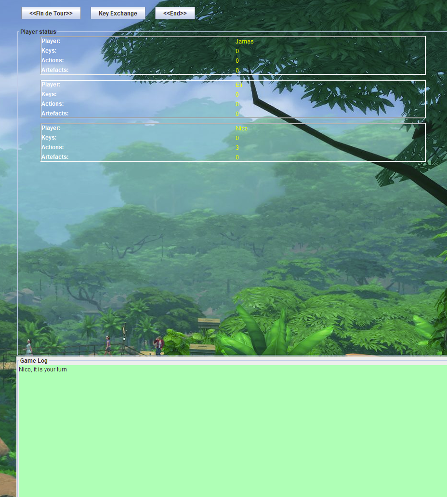

# Ile Interdite

## Description
Le jeu Île Interdite est un jeu de plateforme dans lequel les joueurs ont pour objectif de récupérer 4 artefacts dispersés sur une île qui disparaît progressivement. La partie est remportée lorsque tous les joueurs ont atteint l'hélicoptère avec les artefacts afin de pouvoir s'échapper, le tout avant que les zones ne disparaissent.

## Technologies
- Java
- Architecture MVC
- Swing (Interface graphique)
- Programmation orientée objet

## Fonctionnalités principales
- Gestion de la logique et des états
- Interface interactive (grille, boutons)
- Système d'inondation progressive
- Conditions de victoire et de défaite

## Les élements du jeu
Avant de se plonger dans la conception du jeu, il est important de rappeler les éléments importants du jeu.
Notre île est composée de différentes zones. Elles ont toutes un état spécial.

-Certaines zones sont normales. Il s’agit de zones sans propriété particulière

-Certaines zones sont submergées, c’est-à-dire à moitié inondée. Le joueur peut toujours s’y trouver et se déplacer dessus

-Certaines zones sont inondées. Elles sont totalement enfouies. Un joueur s’y trouvant meurt.

-Une zone sur laquelle se trouve l'hélicoptère

-4 zones où se trouvent les artefacts

En ce qui concerne les joueurs, ils peuvent réaliser trois actions maximum.

-Se déplacer sur une zone adjacente (devant, derrière, en haut, en bas)

-Changer l’état d’une zone submergée pour la rendre normale. Mais ils ne peuvent pas agir sur les zones inondées

-Récupérer un artefact s’ils ont une clé

A la fin de chaque tour, 3 zones verront leur état changer aussi

Un système de clé est aussi présent. Il est crucial car c’est grâce à ce dernier que les joueurs peuvent récupérer les artefacts présents sur l'île.Lorsqu’un joueur cherche une clé, trois choses peuvent se produire
-Il remporte une clé
-Provoque le phénomène de montée des eaux
-Rien ne se passe

Le phénomène de montée des eaux change l’état de trois zones de manière aléatoire. On a donc

-Une zone normale qui devient submergée

-Une zone submergée qui devient inondée

Un rappel des conditions de victoire et de perte

-On gagne si les 4 artefacts sont récupérées et que les joueurs se trouvent sur l'hélicoptère

-On perd si un joueur meurt ou si la zone de l'hélicoptère disparaît

## Le phase de développement et les choix architecturaux réalisés.
Le début de la réflexion commence avec un diagramme de classe. Dans le processus de réalisation, je rencontrais des difficultés à me projeter correctement. Je savais juste que mon projet utiliserait le système MVC(Model-View-Controller). Me rendant compte que je passais trop de temps sur l’élaboration du diagramme de classe, j’ai pris la décision de commander directement. Je suis conscient que cela n’est pas préférable mais je me trouvais dans une situation où je perdais beaucoup de temps.

Dans cette optique, j’ai alors décidé de commencer l'écriture du code. L’objectif dans un premier temps était de construire le MVP (Minimum Viable Product). L'idée principale était:

-Un répertoire contenant tous les aspects visuels de notre projet

-Un répertoire pour le controller

-Un répertoire pour l’aspect logique

Dans la version finale du MVP, nous avions

### Une grille représentant l ’île sur la gauche 
Cette grille est un tableau en deux dimensions où chaque zone a une taille de 30. Cette grille est en relation avec une autre classe island qui s’occupe de la logique interne de la grille. Dans la classe island, la hauteur et la largeur ont été fixées à 20. Ces nombres sont des choix purement aléatoires. Il s’agit d’un choix de ma part de construire le projet avec ces dimensions. La taille final en pixels est:
(30*20) = largeur et hauteur en pixels

Le contrôleur s’occupe de faire communiquer les deux entités.C’est alors que le système MVC entre en jeu.Par exemple, l'affichage visuel de la grille est réalisée de la manière suivante

- On ajoute la grille en tant qu’observateur de la classe `Island` :

```java
this.plateau.addObserver(this); // The grid observes the island like that
```
-Ensuite lors de la création de la classe island dans le constructeur, on ajoute la méthode notifyobservers qui s’occupe de déclencher la méthode paint de la classe grid activant par la même occasion la méthode paintcomponent et les méthodes liées à elle
```java
notifyObservers();
```
Ce système est énormément utilisé dans le projet dans sa globalité.
Le déplacement du joueur est aussi assuré par la méthode déplacement ajoutée dans la classe player qui est aussi observée par la class grid. Cela permet au joueur de se déplacer.J’ai décidé d’utiliser un switch statement qui me permettaient de réaliser en fonction de la direction que le joueur prenait. Cette direction est représentée par la classe enum direction. 

L'assèchement quant à lui est assuré par la méthode assèchement dans la classe island.Elle utilise aussi une switch statement ce qui rend les choses plus simples pour manipuler un type enum

Le système de récupération d’artefact est assuré par la méthode récup Artefacts dans la class island aussi. Ici on remarque un autre type enum. J’ai fait ce choix afin de représenter l'état d’une zone qui peut soit être norma, submergée, inondée, contenir l'hélicoptère ou un artefact
```java
package model;

public enum ZoneState {
    NORMAL, FLOODED, SUNK, HELICOPTER, ARTEFACTS;  // States for a zone
}
```
Le phénomène de changer l’état de 3 zones aléatoires à chaque fin de tour est assuré par la méthode de la class island.



### La section de droite avec les paramètres de jeu
Cette section est principalement liée aux classes buttons et Window pour l’aspect visuel et les classes island et player pour la logique.
Le contrôleur contrôle la classe buttons.
```java
window.getGrid().addKeyListener(ctrl);
window.getButtons().getFinDeTour().addActionListener(ctrl);
window.getButtons().getPartyWon().addActionListener(ctrl);
window.getButtons().getKeyExchange().addActionListener(ctrl);
```

Le système de clé est assuré en appuyant sur le bouton fin de tour. Deux méthodes présentes dans la classe island sont utilisées: floodPlayer  et generateKey. Afin de simuler un événement aléatoire, j’ai utilisé le Math random avec 30% de chance de gagner une clé ou de provoquer la montée des eaux  et 40% de chance que rien ne se passe.

La montée des eaux est réalisée grâce à la méthode floodplayer. Elle utilisé le type enum ZoneState et elle change l’état de la zone en fonction de son état précédent.

Le button PartyWon est déclenché grâce à la méthode updatePartyButton dans la class controller. Cette méthode  s’assure que les conditions de victoire sont respectées notamment avec les méthode la méthode winningParty qui s’assure que tous les joueurs sont sur la zone hélicoptère et que les artéfacts sont récupérés.

La méthode exchangeKeys  permet au joueur actuel de donner sa clé au joueur suivant

Un choix que j’ai fait est que dans l’ensemble du jeu, le joueur actuel est présent dans controlleur en tant qu’attribut. Cela me semblait plus facile à gérer. Tout ce que j’avais à faire était de juste appliquer les méthodes qui m'intéressent sur le jour actuel présent dans la class Control. 




## Les fonctionnalités ajoutées
Après avoir fini le MVP, j’ai décidé d’ajouter certaines fonctionnalités

-Une musique de fond
Pour réaliser cela, j’ai ajouté une méthode backgroundmusic dans la classe Window. J’ai utilisé le concept de thread que je connaissais pas. Cela m’a permis de faire des actions simultanées qui ont fait tourner le jeu et la musique en fond.

-Une image de fond
Pour réaliser cela, j’ai créé une nouvelle class backgroundImage. Dans cette classe, j’ai configuré, j’ai ouvert l’image JUNGLE IMAGE.jpg. J’ai par la suite utiliser ce background dans ma classe Window afin que tous les éléments du jeux repose dessus

-Un game log
En ce qui concerne le gamer log, j’ai utilisé un composant plus précisément JTextArea, pour afficher des informations sur la partie de jeu et JScrollPane afin qu’on puisse scroller dans lequel on a beaucoup de texte dans le gamer log.

Un écran d’accueil et la possibilité de joueur avec au plus 3 joueurs
L’écran d’accueil est une nouvelle classe IntroWindow dans lequel je représente le titre du jeu, des zones pour entrer les noms des joueurs et un bouton pour commencer le jeu. Dans le cas où, on n’entre pas noms et qu’on appuie le bouton de démarrage du jeu, un message s’affiche nous disant d’entrer des noms. L’écran d’accueil prend aussi en compte le fait d’ajouter seulement les joueurs dont le nom a été entré dans la fenêtre de jeu


## Les problèmes rencontrés

La difficulté principale que j’ai rencontrée était l’agencement des éléments du jeu. Pour résoudre ce souci et obtenir le résultat que je souhaitais, j’ai dû créer un JPanel mainPanel dans lequel j’ai superposé la grille de jeu et un autre panel que j’ai appelé uiOverlay.

J’ai ensuite ajouté gameSettings dans uiOverly qui est le panneau se trouvant au-dessus de mainPanel. J’ai configuré gameSettings de la manière dont je voulais que les éléments soient visuellement, c’est-à-dire

-gameSettings à droite donc avec BorderLayout.East

-Puis les boutons dans gameSettings en haut donc avec BorderLayou.NORTH

-Les information du joueur avec BorderLayout.CENTER

-Puis le gamelog tout en bas avec BorderLayout.SOUTH

J’ai par la suite tout ajouté à mon backgroundImage pour que les élements soient sur mon image de fond. Cela m’a pris beaucoup de temps.

Ci-dessus une photo final de mon rendu


## Bilan
Tout au long du projet, j’ai essayé de faire de mon mieux pour implémenter les fonctionnalités principales. Un de mes plus grands regrets est de ne pas avoir utilisé Junit pour tester mes méthodes. J’ai bien sûr utilisé beaucoup de print statements pour voir l’évolution de mon jeu et s'assurer que la globalité des fonctionnalités marche mais j’aurais pu construire un code plus robuste avec Junit. Ce jeu peut bien sûr être encore plus amélioré avec des niveaux, plus de joueurs, un gamer log plus détaillé ou encore ajouter des rôles pour chaque joueur.

